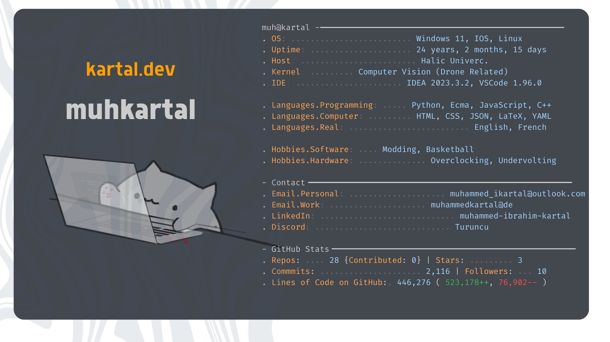

# 👋 Welcome! I'm **Muhammed Ibrahim Kartal**

**`Software Engineer | AI Enthusiast | Machine Learning Developer`**

I'm a final-year Software Engineering student at **Haliç University**, deeply passionate about exploring the endless possibilities of **Machine Learning**, **Artificial Intelligence**, and **Computer Vision**. Over the years, I've honed my skills in AI development, learning how to turn raw data into meaningful, actionable insights. 

---

### 🚀 **About Me**

- **AI Developer Intern** at **Haliç University**, focused on advanced **Computer Vision** projects.
- **Former Technology Leader** at **Google Developer Student Club Haliç**, where I organized and led workshops for university students.
- **Project Leader** for **Teknofest** and **TÜBİTAK 2209-A** competitions, driving solutions in **air defense** and other cutting-edge tech areas.

---

<h2 align="center">⚒️ Languages-Frameworks-Tools ⚒️</h2>

    
     

